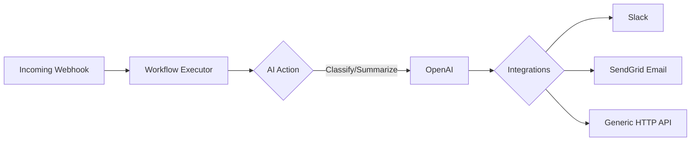
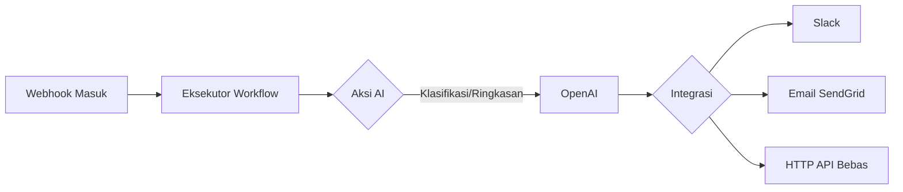

# FastAPI Workflow Engine 🚀

[🇬🇧 English Version](#-english-version) | [🇮🇩 Versi Indonesia](#-versi-indonesia)

---

## 🇬🇧 English Version

An intelligent, asynchronous workflow engine built with FastAPI and PostgreSQL. It allows you to build dynamic workflows combining AI tasks (like classification and summarization) with external integrations (like Slack, Email, and HTTP requests) triggered seamlessly via Webhooks.

### Architecture Flow



### Key Features
- **Webhook Triggers:** Secure endpoints with HMAC verification.
- **AI-Powered Actions:** Built-in AI steps (e.g., classifying leads, generating replies) using OpenAI.
- **Third-Party Integrations:** Connect seamlessly with Slack, SendGrid, or any external HTTP API.
- **Resilient Executor:** Features automatic retries with exponential backoff and fallback values on failure.
- **Dynamic Context Interpolation:** Pass data effortlessly between steps (e.g., passing AI output into a Slack message).
- **Run Polling & Monitoring:** Real-time visibility into the execution status (`PENDING` -> `RUNNING` -> `COMPLETED`) with precise `finished_at` microsecond metrics.

### Setup & Environment Variables

For security, **API keys must never be hardcoded into the codebase or `docker-compose.yml`**, to prevent public exposure when pushed to GitHub.

To run securely, create a file named `.env` in your project root (next to `docker-compose.yml`) and add the following line:

```text
OPENAI_API_KEY=sk-your-secret-api-key
```

Docker will automatically read this `.env` file when you run `docker-compose up -d` without ever committing it to GitHub, as it is ignored in `.gitignore`.

### Quickstart

To run the project locally with the default seeded data, simply use docker-compose:

```bash
docker-compose up -d --build
```

### Triggering a Webhook

You can trigger the demo "Lead Triage" workflow using the following `curl` command. *(Note: If `WEBHOOK_SECRET` is set in your `.env`, you must supply a valid HMAC signature in production).*

```bash
curl -X POST "http://localhost:8000/api/v1/webhooks/1/trigger" \
     -H "Content-Type: application/json" \
     -d '{
         "name": "John Doe",
         "email": "john.doe@example.com",
         "message": "I am extremely interested in your Enterprise plan."
     }'
```

---

## 🇮🇩 Versi Indonesia

Sebuah mesin alur kerja (workflow engine) yang cerdas dan asinkron, dibangun menggunakan FastAPI dan PostgreSQL. Proyek ini memungkinkan Anda membuat otomatisasi dinamis yang menggabungkan tugas berbasis AI (seperti klasifikasi dan peringkasan) dengan integrasi eksternal (seperti Slack, Email, dan HTTP) yang dipicu secara otomatis melalui Webhook.

### Alur Arsitektur



### Fitur Utama
- **Pemicu Webhook:** Endpoint yang aman dengan sistem verifikasi HMAC.
- **Aksi Berbasis AI:** Langkah terintegrasi AI (misal: klasifikasi klien, pembuatan balasan) menggunakan OpenAI.
- **Integrasi Pihak Ketiga:** Terhubung secara instan dengan Slack, SendGrid, atau HTTP API apa pun.
- **Eksekutor Tangguh:** Dilengkapi percobaan ulang otomatis (retry) bertahap dan nilai cadangan (fallback) jika terjadi kegagalan.
- **Interpolasi Konteks Dinamis:** Memindahkan data antar langkah secara cerdas (misal: memasukkan hasil AI ke dalam pesan Slack).
- **Sistem Pemantauan Status (Polling):** Transparansi eksekusi *real-time* dari status `PENDING` -> `RUNNING` -> `COMPLETED` disertai catatan waktu `finished_at` akurasi mikrodetik.

### Persiapan & Variabel Lingkungan

Untuk keamanan, **kunci API tidak boleh ditulis secara permanen ke dalam file kode atau `docker-compose.yml`**, agar tidak terekspos ke publik saat di-*push* ke GitHub.

Cara yang aman untuk menjalankannya: Cukup buat sebuah file bernama `.env` di folder proyek Anda (sejajar dengan `docker-compose.yml`), lalu isi dengan baris ini:

```text
OPENAI_API_KEY=sk-kunci-api-rahasia-anda
```

Docker secara otomatis akan membaca file `.env` ini saat Anda menjalankan `docker-compose up -d`, tanpa pernah menyimpannya ke GitHub karena sudah diabaikan di `.gitignore`.

### Memulai Cepat (Quickstart)

Untuk menjalankan proyek ini secara lokal beserta data awal yang sudah disiapkan, gunakan docker-compose:

```bash
docker-compose up -d --build
```

### Memicu Webhook

Anda dapat memicu alur kerja demo "Lead Triage" menggunakan perintah `curl` berikut. *(Catatan: Jika `WEBHOOK_SECRET` diatur di dalam `.env`, Anda wajib menyertakan signature HMAC yang valid saat di tingkat produksi).*

```bash
curl -X POST "http://localhost:8000/api/v1/webhooks/1/trigger" \
     -H "Content-Type: application/json" \
     -d '{
         "name": "Budi",
         "email": "budi@example.com",
         "message": "Saya tertarik dengan paket Enterprise Anda."
     }'
```
