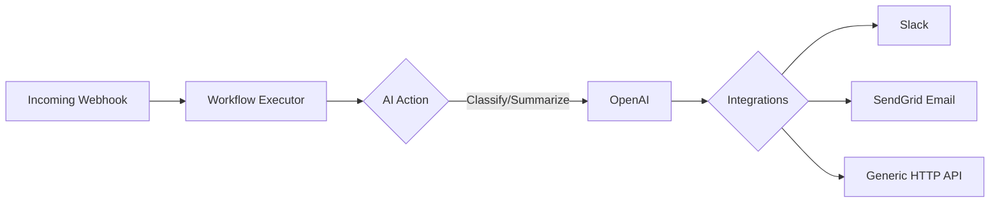

# FastAPI Workflow Engine

An intelligent, asynchronous workflow engine built with FastAPI, PostgreSQL, and Redis. It allows you to build dynamic workflows combining AI tasks (like classification and summarization) with external integrations (like Slack, Email, and HTTP requests) triggered seamlessly via Webhooks.

## Architecture Flow



## Quickstart

To run the project locally with the default seeded data, simply use docker-compose:

```bash
docker-compose up -d --build
```
*(Make sure you have populated the `.env` file from `.env.example` first).*

## Triggering a Webhook

You can trigger the demo Lead Triage workflow using the following `curl` command. Note: if you have set `WEBHOOK_SECRET` in your `.env`, you must supply a valid HMAC signature. If testing without verification, you can comment out the signature check or leave the secret empty.

```bash
curl -X POST "http://localhost:8000/api/v1/webhooks/1/trigger" \
     -H "Content-Type: application/json" \
     -d '{
         "name": "Budi",
         "email": "budi@example.com",
         "message": "I am interested in your Enterprise plan."
     }'
```
